# Flutter Employment Management App

A comprehensive Flutter application for managing employee records with offline-first capability and clean architecture.

## Features

- User authentication (register, login, logout)
- Employee management (add, view, edit, delete)
- Profession category management
- Employee search functionality
- Light/Dark theme support
- Settings with user profile
- Offline database with SQLite
- Performance optimization with Flutter isolates
- Clean architecture with BLoC/Cubit state management
- Internationalization (i18n) support
- Material 3 design implementation

## Architecture

The application follows clean architecture principles with the following layers:

- **Domain Layer**: Core business logic and entities
- **Data Layer**: Data sources and repositories implementation
- **Presentation Layer**: UI components and state management
- **Core**: Shared utilities and widgets

## Use Case Diagram

```mermaid
graph TB
    subgraph Users
        User((User))
    end
    
    subgraph Authentication
        Register[Register]
        Login[Login]
        Logout[Logout]
        ViewProfile[View Profile]
    end
    
    subgraph Employee Management
        AddEmployee[Add Employee]
        ViewEmployees[View Employees]
        EditEmployee[Edit Employee]
        DeleteEmployee[Delete Employee]
        SearchEmployees[Search Employees]
        FilterCurrentEmployees[Filter Current Employees]
        FilterPastEmployees[Filter Past Employees]
    end
    
    subgraph Profession Management
        AddProfession[Add Profession]
        ViewProfessions[View Professions]
        EditProfession[Edit Profession]
        DeleteProfession[Delete Profession]
    end
    
    subgraph Settings
        ToggleTheme[Toggle Theme]
        ViewAppInfo[View App Info]
    end
    
    User --> Register
    User --> Login
    User --> Logout
    User --> ViewProfile
    
    User --> AddEmployee
    User --> ViewEmployees
    User --> EditEmployee
    User --> DeleteEmployee
    User --> SearchEmployees
    User --> FilterCurrentEmployees
    User --> FilterPastEmployees
    
    User --> AddProfession
    User --> ViewProfessions
    User --> EditProfession
    User --> DeleteProfession
    
    User --> ToggleTheme
    User --> ViewAppInfo
```



## Project Structure

```
lib/
├── core/
│   ├── base/
│   ├── compute/
│   ├── config/
│   ├── database/
│   ├── di/
│   ├── errors/
│   │   ├── exceptions/
│   │   ├── failures/
│   │   └── handler/
│   ├── helpers/
│   ├── routes/
│   ├── services/
│   ├── storage/
│   └── utils/
├── data/
│   ├── datasources/
│   ├── models/
│   │   ├── bottom_navbar/
│   │   ├── employee/
│   │   ├── error/
│   │   ├── profession/
│   │   └── user/
│   └── repositories/
├── domain/
│   ├── entities/
│   │   ├── employee/
│   │   ├── profession/
│   │   └── user/
│   └── repositories/
│       ├── employee/
│       ├── profession/
│       └── user/
├── gen/
│   └── assets.gen.dart
├── l10n/
│   ├── app_en.arb
│   ├── app_localizations.dart
│   └── app_localizations_en.dart
├── presentation/
│   ├── bloc/
│   │   ├── dashboard/
│   │   ├── employee/
│   │   ├── profession/
│   │   └── system/
│   ├── ui/
│   │   ├── auth/
│   │   ├── dashboard/
│   │   │   ├── components/
│   │   │   └── sections/
│   │   ├── employee/
│   │   │   └── components/
│   │   ├── profession/
│   │   │   ├── form/
│   │   │   │   └── components/
│   │   │   └── main/
│   │   ├── settings/
│   │   └── splash/
│   └── widgets/
│       ├── appbar/
│       ├── button/
│       └── forms/
│           ├── date_time_fields/
│           └── input_fields/
├── app.dart
└── main.dart
```

## Database Schema

### User Table
```sql
CREATE TABLE users (
  id TEXT PRIMARY KEY,
  username TEXT NULLABLE,
  avatar TEXT NULLABLE,
  email TEXT NULLABLE,
  password TEXT NULLABLE,
  created_at TEXT NULLABLE,
  updated_at TEXT NULLABLE
);
```

### Employee Table
```sql
CREATE TABLE employees (
  id TEXT PRIMARY KEY,
  full_name TEXT NULLABLE,
  avatar TEXT NULLABLE,
  email TEXT NULLABLE,
  phone TEXT NULLABLE,
  profession JSON NULLABLE,
  joining_date TEXT NULLABLE,
  final_date TEXT NULLABLE,
  created_at TEXT NULLABLE,
  updated_at TEXT NULLABLE
);
```

### Profession Table
```sql
CREATE TABLE professions (
  id TEXT PRIMARY KEY,
  name TEXT NULLABLE,
  created_at TEXT NULLABLE,
  updated_at TEXT NULLABLE
);
```

## State Management

The application uses BLoC pattern with Cubit implementation for state management:

- **System Cubit**: Manages app-wide settings like theme and app information
- **Dashboard Cubit**: Handles the main dashboard state and navigation
- **Employee Cubit**: Manages employee data operations
- **Profession Cubit**: Manages profession data operations

## Dependency Injection

The project uses `get_it` with `injectable` for dependency injection, allowing for:
- Singleton and lazySingleton registration
- Factory registration
- Automatic dependency resolution

## Localization

Internationalization is implemented using the Flutter Intl package:
- Currently supports English
- Structured for easy addition of more languages
- Message catalog in ARB files

## Assets Management

The project uses FlutterGen to generate type-safe asset references:
- Icons (SVG format)
- Images 
- Logos

## Getting Started

### Prerequisites
- Flutter SDK (2.10.0 or higher)
- Dart SDK (2.16.0 or higher)
- Android Studio / VS Code with Flutter plugins

### Installation

1. Clone the repository
```bash
git clone https://github.com/princeteck/flutter-ems.git
```

2. Navigate to the project directory
```bash
cd flutter_employee_manager
```

3. Get dependencies
```bash
flutter pub get
```

4. Run the app
```bash
flutter run
```

## Performance Optimizations

The app uses Flutter isolates to offload heavy operations from the UI thread:
- Database operations through IsolateManager
- Data filtering and searching
- JSON parsing and serialization
- Error handling with dedicated mechanisms

## Future Enhancements

This application is designed with extensibility in mind:

- Online synchronization capability
- API integration
- Advanced reporting features
- Data export/import functionality
- Role-based access control

## Dependencies

### Main Dependencies
- flutter_bloc: ^9.1.0
- sqflite: ^2.4.2
- path: ^1.9.1
- get_it: ^8.0.3
- dartz: ^0.10.1
- intl: ^0.19.0
- fluttertoast: ^8.2.2
- shared_preferences: ^2.5.3
- flutter_secure_storage: ^9.2.4
- flutter_svg: ^2.0.17
- cached_network_image: ^3.4.1
- go_router: ^14.8.1
- freezed_annotation: ^3.0.0
- json_annotation: ^4.9.0
- flutter_screenutil: ^5.9.3
- flutter_native_splash: ^2.4.6
- path_provider: ^2.1.5
- permission_handler: ^11.4.0
- google_fonts: ^6.2.1
- injectable: ^2.5.0
- package_info_plus: ^8.3.0
- uih: ^1.0.5
- cupertino_icons: ^1.0.8
- uuid: ^4.5.1
- flutter_slidable: ^4.0.0
- flutter_launcher_icons: ^0.14.3
- flutter_gen_runner: ^5.10.0

### Dev Dependencies
- flutter_lints: ^5.0.0
- build_runner: ^2.4.15
- mockito: ^5.4.5
- freezed: ^3.0.6
- json_serializable: ^6.9.4
- injectable_generator: ^2.7.0
- package_rename: ^1.9.0
- flutter_gen_runner: ^5.10.0

## License

This project is licensed under the MIT License - see the LICENSE file for details.