# Flutter Employment Management App

A comprehensive Flutter application for managing employee records with offline-first capability and clean architecture.

## Features

- User authentication (register, login, logout)
- Employee management (add, view, edit, delete)
- Profession category management
- Employee search functionality
- Light/Dark theme support
- Settings with user profile
- Offline database with SQLite
- Performance optimization with Flutter isolates
- Clean architecture with BLoC/Cubit state management

## Architecture

The application follows clean architecture principles with the following layers:

- **Domain Layer**: Core business logic and entities
- **Data Layer**: Data sources and repositories implementation
- **Presentation Layer**: UI components and state management
- **Core**: Shared utilities and widgets

## Use Case Diagram

```mermaid
graph TB
    subgraph Users
        User((User))
    end
    
    subgraph Authentication
        Register[Register]
        Login[Login]
        Logout[Logout]
        ViewProfile[View Profile]
    end
    
    subgraph Employee Management
        AddEmployee[Add Employee]
        ViewEmployees[View Employees]
        EditEmployee[Edit Employee]
        DeleteEmployee[Delete Employee]
        SearchEmployees[Search Employees]
        FilterCurrentEmployees[Filter Current Employees]
        FilterPastEmployees[Filter Past Employees]
    end
    
    subgraph Profession Management
        AddProfession[Add Profession]
        ViewProfessions[View Professions]
        EditProfession[Edit Profession]
        DeleteProfession[Delete Profession]
    end
    
    subgraph Settings
        ToggleTheme[Toggle Theme]
        ViewAppInfo[View App Info]
    end
    
    User --> Register
    User --> Login
    User --> Logout
    User --> ViewProfile
    
    User --> AddEmployee
    User --> ViewEmployees
    User --> EditEmployee
    User --> DeleteEmployee
    User --> SearchEmployees
    User --> FilterCurrentEmployees
    User --> FilterPastEmployees
    
    User --> AddProfession
    User --> ViewProfessions
    User --> EditProfession
    User --> DeleteProfession
    
    User --> ToggleTheme
    User --> ViewAppInfo
```



## Project Structure

```
lib/
├── core/
│   ├── constants/
│   ├── errors/
│   ├── network/
│   ├── util/
│   ├── widgets/
│   └── compute/
├── data/
│   ├── datasources/
│   ├── models/
│   ├── repositories/
│   └── sync/
├── domain/
│   ├── entities/
│   ├── repositories/
│   └── usecases/
├── presentation/
│   ├── bloc/
│   ├── pages/
│   └── widgets/
├── di/
├── config/
├── app.dart
└── main.dart
```

## Database Schema

### User Table
```sql
CREATE TABLE users (
  id INTEGER PRIMARY KEY AUTOINCREMENT,
  username TEXT NOT NULL UNIQUE,
  password TEXT NOT NULL,
  avatar TEXT,
  created_at TEXT NOT NULL
);
```

### Employee Table
```sql
CREATE TABLE employees (
  id INTEGER PRIMARY KEY AUTOINCREMENT,
  name TEXT NOT NULL,
  profession_id INTEGER NOT NULL,
  email TEXT,
  phone TEXT,
  hire_date TEXT NOT NULL,
  end_date TEXT,
  is_current INTEGER NOT NULL,
  notes TEXT,
  created_at TEXT NOT NULL,
  updated_at TEXT NOT NULL,
  FOREIGN KEY (profession_id) REFERENCES professions (id)
);
```

### Profession Table
```sql
CREATE TABLE professions (
  id INTEGER PRIMARY KEY AUTOINCREMENT,
  name TEXT NOT NULL UNIQUE,
  description TEXT,
  created_at TEXT NOT NULL,
  updated_at TEXT NOT NULL
);
```

## Getting Started

### Prerequisites
- Flutter SDK (2.10.0 or higher)
- Dart SDK (2.16.0 or higher)
- Android Studio / VS Code with Flutter plugins

### Installation

1. Clone the repository
```bash
git clone https://github.com/yourusername/flutter_employee_manager.git
```

2. Navigate to the project directory
```bash
cd flutter_employee_manager
```

3. Get dependencies
```bash
flutter pub get
```

4. Run the app
```bash
flutter run
```

## Performance Optimizations

The app uses Flutter isolates to offload heavy operations from the UI thread:
- Database operations
- Data filtering and searching
- JSON parsing and serialization

## Future Enhancements

This application is designed with extensibility in mind:

- Online synchronization capability
- API integration
- Advanced reporting features
- Data export/import functionality
- Role-based access control

## Dependencies

### Main Dependencies
- flutter_bloc: ^9.1.0
- sqflite: ^2.4.2
- path: ^1.9.1
- get_it: ^8.0.3
- dartz: ^0.10.1
- intl: ^0.20.2
- fluttertoast: ^8.2.12
- shared_preferences: ^2.5.3
- connectivity_plus: ^5.0.1
- dio: ^5.3.3
- flutter_secure_storage: ^9.0.0
- flutter_svg: ^2.0.17
- cached_network_image: ^3.4.1
- go_router: ^14.8.1
- freezed_annotation: ^3.0.0
- json_annotation: ^4.9.0
- flutter_screenutil: ^5.9.3
- flutter_native_splash: ^2.4.6
- path_provider: ^2.1.5
- permission_handler: ^11.4.0
- google_fonts: ^6.2.1
- injectable: ^2.5.0
- package_info_plus: ^8.3.0
- uih: ^1.0.5

### Dev Dependencies
- flutter_lints: ^5.0.0
- build_runner: ^2.4.15
- mockito: ^5.4.5
- freezed: ^3.0.6
- json_serializable: ^6.9.4
- injectable_generator: ^2.7.0
- package_rename: ^1.9.0

## License

This project is licensed under the MIT License - see the LICENSE file for details.